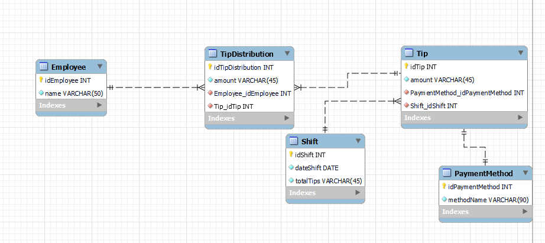

# Prueba Técnica Softii
## Por: Armando Arredondo Valle

### ¿Cómo instalar el backend?

Ejecutar el comando: `npm i --s` para así hacer la instalación de librerías.

### Instalar base de datos
Abrir el archivo [BASE DE DATOS](./database/main.sql) y correrlo en su editor de base de datos favorito.

En automático el backend se inciará en la ruta `localhost:3001` , para iniciarlo es necesario correr el comando `ts-node main.ts`.

A continuación se incluye un diagrama de la base de datos:

Video del funcionamiento:
[https://youtu.be/uv6YtBot2fY](https://youtu.be/uv6YtBot2fY)